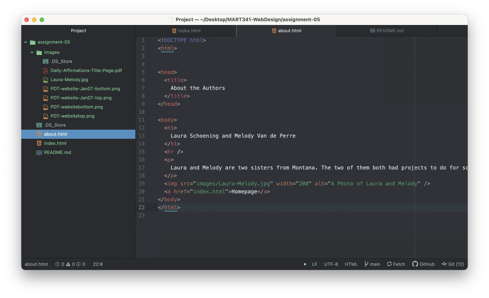
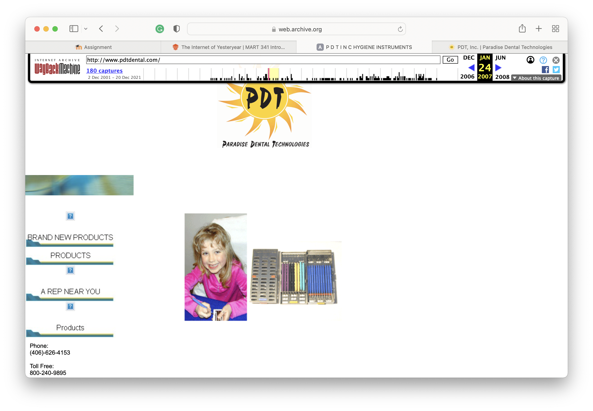
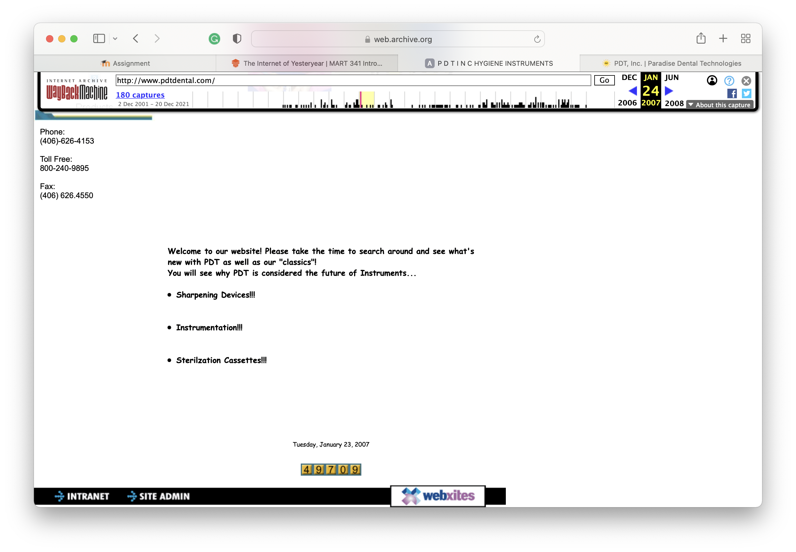
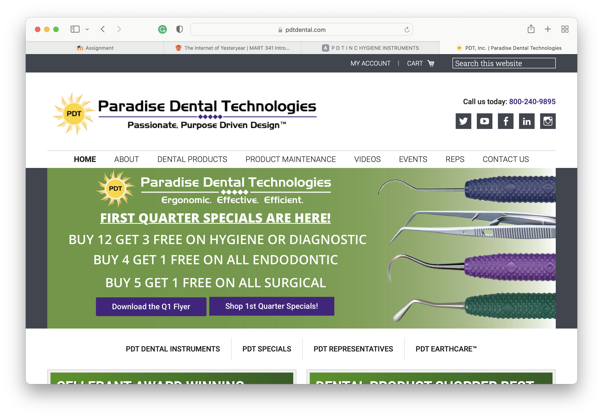
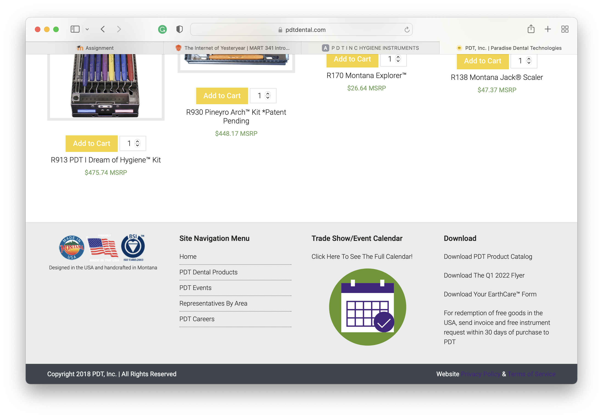

The website that I visited was PDT Inc. I compared their current website to their January 2007 website. Their menu that is currently at the top of the website was on the right side in 2007. There was a lot of white space that was not filled in with anything and the overall format was pretty spaced out. The website from 2007 did not have a proper footer but the new one does.
p.s. The little girl on the website from 2007 is me!

