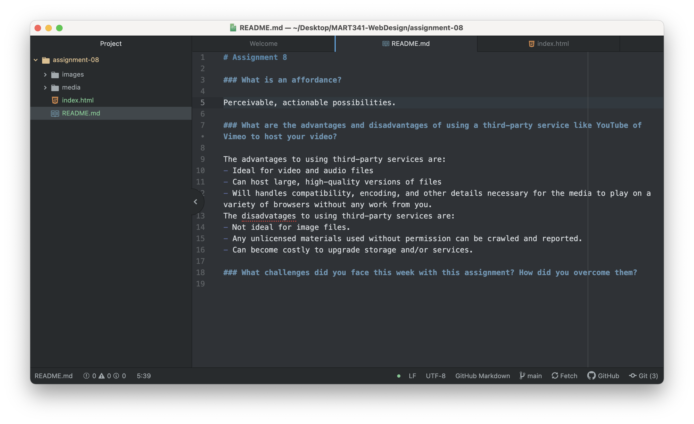

# Assignment 8

### What is an affordance?

#### Perceivable, actionable possibilities.

### What are the advantages and disadvantages of using a third-party service like YouTube of Vimeo to host your video?

#### The advantages to using third-party services are:
- Ideal for video and audio files
- Can host large, high-quality versions of files
- Will handles compatibility, encoding, and other details necessary for the media to play on a variety of browsers without any work from you.

#### The disadvatages to using third-party services are:
- Not ideal for image files.
- Any unlicensed materials used without permission can be crawled and reported.
- Can become costly to upgrade storage and/or services.

