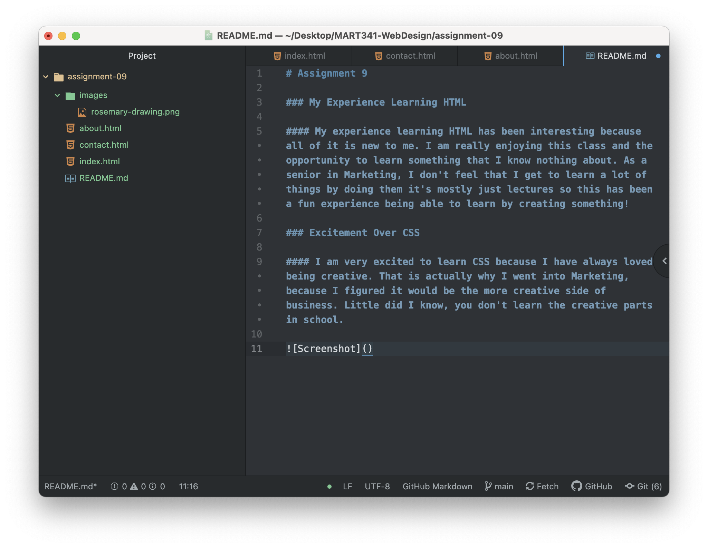

# Assignment 9

### My Experience Learning HTML

#### My experience learning HTML has been interesting because all of it is new to me. I am really enjoying this class and the opportunity to learn something that I know nothing about. As a senior in Marketing, I don't feel that I get to learn a lot of things by doing them it's mostly just lectures so this has been a fun experience being able to learn by creating something!

### Excitement Over CSS

#### I am very excited to learn CSS because I have always loved being creative. That is actually why I went into Marketing, because I figured it would be the more creative side of business. Little did I know, you don't learn the creative parts in school, so this is an exciting change.

