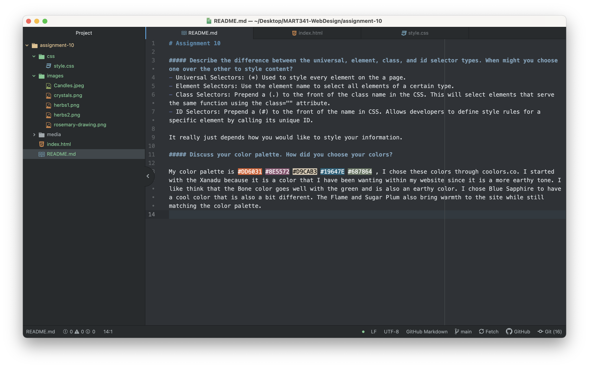

# Assignment 10

##### Describe the difference between the universal, element, class, and id selector types. When might you choose one over the other to style content?
- Universal Selectors: (*) Used to style every element on the a page.
- Element Selectors: Use the element name to select all elements of a certain type.
- Class Selectors: Prepend a (.) to the front of the class name in the CSS. This will select elements that serve the same function using the class="" attribute.
- ID Selectors: Prepend a (#) to the front of the name in CSS. Allows developers to define style rules for a specific element by calling its unique ID.

It really just depends how you would like to style your information.

##### Discuss your color palette. How did you choose your colors?

My color palette is #DD6031 #8E5572 #D9CAB3 #19647E #687864 , I chose these colors through coolors.co. I started with the Xanadu because it is a color that I have been wanting within my website since it is a more earthy tone. I like think that the Bone color goes well with the green and is also an earthy color. I chose Blue Sapphire to have a cool color that is also a bit different. The Flame and Sugar Plum also bring warmth to the site while still matching the color palette.

