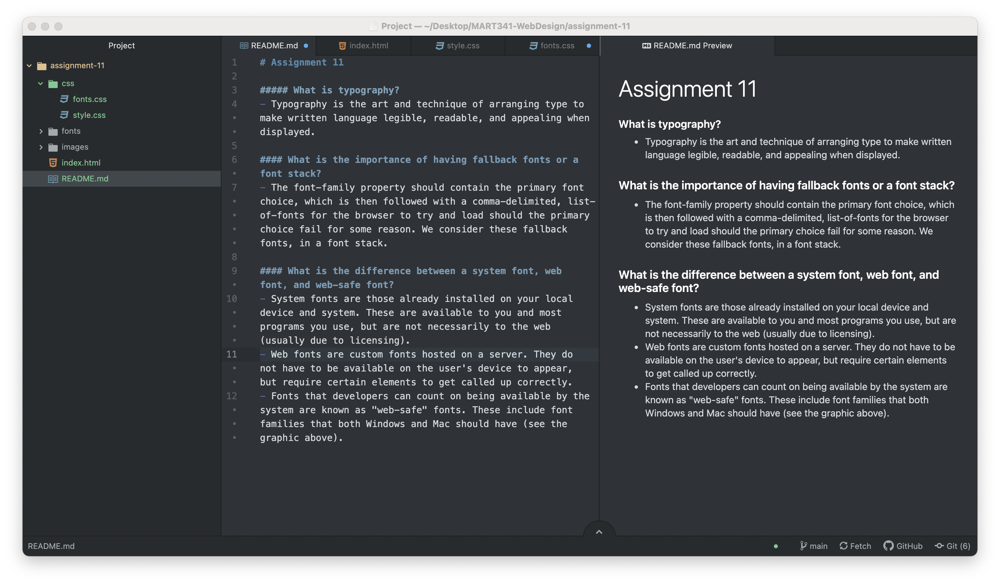

# Assignment 11

##### What is typography?
- Typography is the art and technique of arranging type to make written language legible, readable, and appealing when displayed.

#### What is the importance of having fallback fonts or a font stack?
- The font-family property should contain the primary font choice, which is then followed with a comma-delimited, list-of-fonts for the browser to try and load should the primary choice fail for some reason. We consider these fallback fonts, in a font stack.

#### What is the difference between a system font, web font, and web-safe font?
- System fonts are those already installed on your local device and system. These are available to you and most programs you use, but are not necessarily to the web (usually due to licensing).
- Web fonts are custom fonts hosted on a server. They do not have to be available on the user's device to appear, but require certain elements to get called up correctly.
- Fonts that developers can count on being available by the system are known as "web-safe" fonts. These include font families that both Windows and Mac should have.

